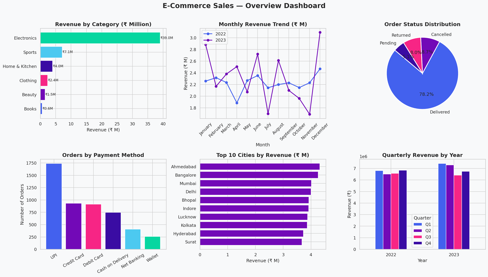
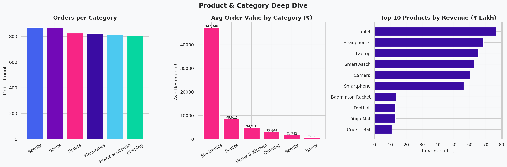
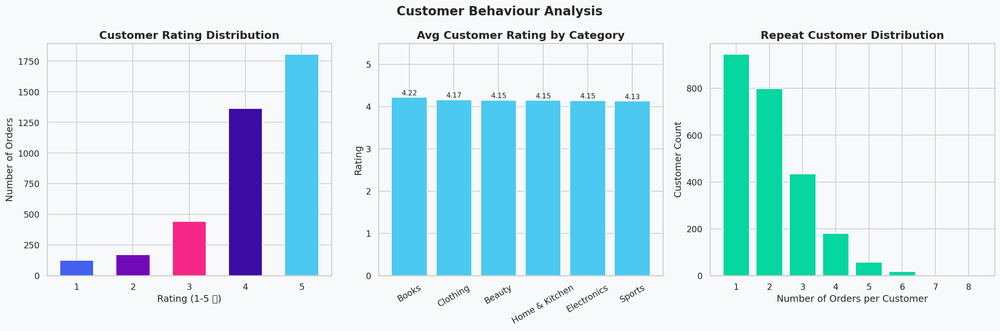
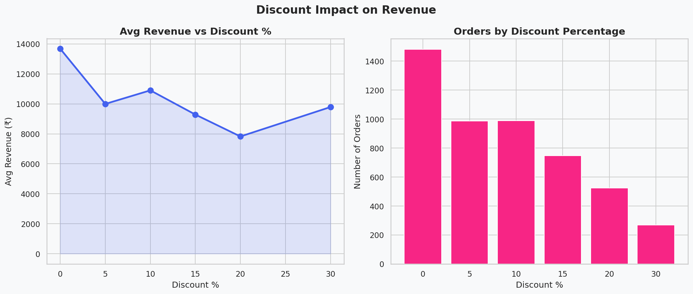
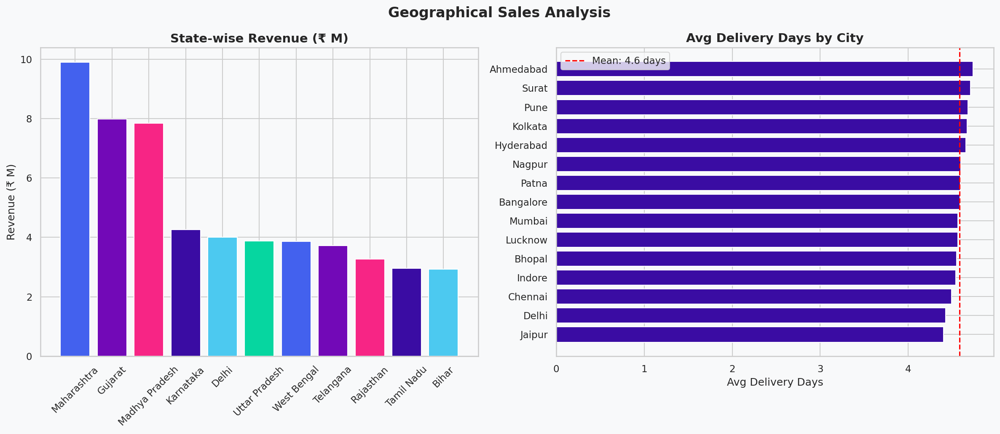
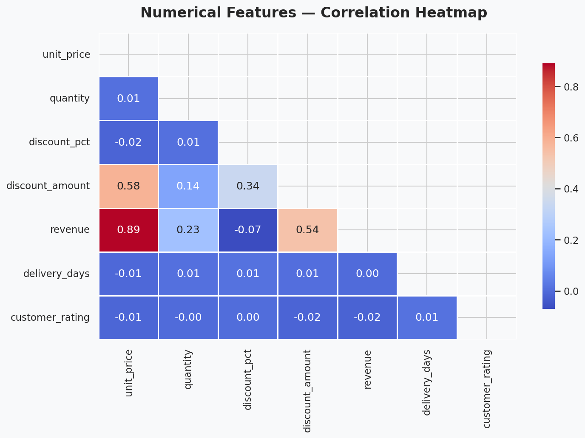

# 🛒 E-Commerce Sales Dashboard & EDA

A complete **Exploratory Data Analysis** project on Indian e-commerce sales data.

---

## 📊 Key Insights

| Metric | Value |
|--------|-------|
| 💰 Total Revenue | ₹54.62 Million |
| 🛒 Total Orders | 5,000 |
| 💵 Avg Order Value | ₹10,924 |
| 👥 Unique Customers | 2,439 |
| ⭐ Avg Rating | 4.16 / 5.0 |
| 🚚 Avg Delivery Time | ~5 days |
| 📦 Delivery Rate | 78.2% |
| 🏆 Top Category | Electronics |
| 💳 Top Payment | UPI (35%) |

---

## 📁 Project Structure

| File | Description |
|------|-------------|
| `ecommerce_data.csv` | Dataset with 5000 orders |
| `eda_analysis.py` | Full EDA Python script |
| `generate_data.py` | Dataset generator script |
| `EDA_Notebook.ipynb` | Jupyter Notebook |
| `requirements.txt` | Python dependencies |
| `charts/` | All 6 visualizations |

---

## 📈 Analysis Sections

- ✅ Data Quality Check
- ✅ Revenue Analysis (Monthly & Quarterly)
- ✅ Product & Category Performance
- ✅ Customer Behaviour & Ratings
- ✅ Payment Method Analysis
- ✅ Discount Impact Analysis
- ✅ Geographical Sales Analysis
- ✅ Correlation Heatmap

---

## 🚀 How to Run

    git clone https://github.com/MSHOHEB/ecommerce-eda.git
    cd ecommerce-eda
    pip install -r requirements.txt
    python eda_analysis.py

---

## 🛠️ Tech Stack

- **Python** — Core language
- **Pandas** — Data manipulation
- **Matplotlib & Seaborn** — Visualizations
- **NumPy** — Numerical computing
- **Jupyter Notebook** — Interactive analysis

---
## 📊 Charts & Visualizations

### 1. Overview Dashboard

### 2. Product & Category Analysis

### 3. Customer Behaviour

### 4. Discount Analysis

### 5. Geographical Analysis

### 6. Correlation Heatmap

